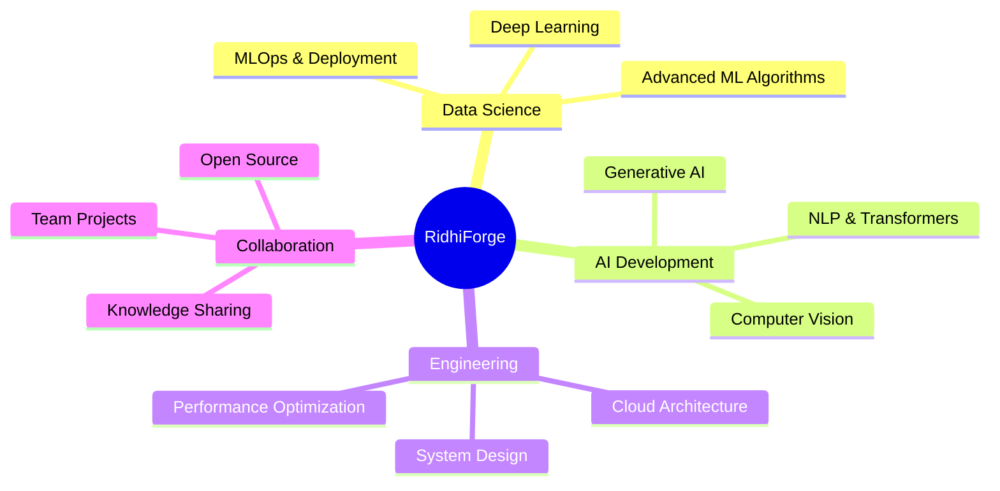

<!-- Animated Header with Gradient Background -->

<!-- Typing Animation -->

 

<!-- Animated Badges -->

  

*"Forging data into insights | Building with Python, SQL & Machine Learning"*

---

<!-- Animated Section Divider -->

##  Tech Stack & Skills

  

### 🎯 Core Competencies

| Domain | Technologies |
|:------:|:------------|
| **🤖 Machine Learning** | TensorFlow, PyTorch, Scikit-learn, XGBoost, Neural Networks |
| **📊 Data Analysis** | Pandas, NumPy, Matplotlib, Seaborn, Plotly, Power BI |
| **🗄️ Databases** | MySQL, PostgreSQL, MongoDB, SQLite |
| **🐍 Python Development** | FastAPI, Flask, Django, REST APIs |
| **☁️ Cloud & DevOps** | AWS, GCP, Docker, Git, CI/CD |
| **🧠 AI & NLP** | Transformers, BERT, FinBERT, Hugging Face, spaCy |

---

##  Featured Projects Portfolio

<!-- Project Cards with Animations -->

### 🛡️ AI & Security Solutions

<table>
<tr>
<td width="50%">

<h3 align="center">SurakshaOS - AI for Bharat</h3>

  

  

<strong>AI-Powered Community Security System</strong>

🔐 Advanced security platform leveraging artificial intelligence to enhance community safety and surveillance systems across India.

</td>
<td width="50%">

<h3 align="center">LokVaani WolfForge</h3>

  

  

<strong>Voice Communication Platform</strong>

🎤 Revolutionary voice-based communication tool designed to break language barriers and enable seamless multilingual conversations.

</td>
</tr>
</table>

### 🏥 Healthcare & FinTech AI

<table>
<tr>
<td width="50%">

<h3 align="center">Health Predictor</h3>

  

  

<strong>ML Health Prediction System</strong>

🩺 Smart assistant predicting potential health conditions based on symptoms, recommending natural remedies and yoga practices using machine learning.

</td>
<td width="50%">

<h3 align="center">Financial News Sentiment Analyzer</h3>

  

  

<strong>FinBERT NLP Application</strong>

📈 AI-powered sentiment analysis tool classifying financial news as Positive, Negative, or Neutral using state-of-the-art FinBERT model.

</td>
</tr>
</table>

### 📊 Data Analytics & Business Intelligence

<table>
<tr>
<td width="50%">

<h3 align="center">Employee Attrition Analysis</h3>

  

  

<strong>HR Analytics & Predictive Modeling</strong>

📊 Comprehensive EDA and machine learning project exploring employee attrition patterns to help organizations retain talent effectively.

</td>
<td width="50%">

<h3 align="center">Portfolio Website</h3>

  

  

<strong>Personal JavaScript Portfolio</strong>

🖥️ Interactive portfolio website showcasing projects, skills, and professional journey with modern web technologies and animations.

</td>
</tr>
</table>

### 🎯 Experiments & Learning

<table>
<tr>
<td width="100%">

<h3 align="center">RidhiForge - Experimental Hub</h3>

  

  

<strong>Code Experiments & Innovation Lab</strong>

🔬 Personal repository for code experiments, data visualizations, Python demos, and exploring cutting-edge technologies and methodologies.

</td>
</tr>
</table>

---

## 📊 GitHub Analytics & Achievements

<!-- GitHub Stats with Animation -->

 

<!-- Language Stats -->

<!-- Activity Graph -->

<!-- Trophy Stats -->

---

## 🎯 Current Focus & Learning Journey

### 🚀 What I'm Currently Working On:

- 🔍 **Mastering Advanced ML Algorithms** - Diving deep into neural networks, ensemble methods, and MLOps
- 🌍 **Open Source Contributions** - Contributing to data science and AI projects
- 🤝 **Building Innovative Solutions** - Developing AI-powered applications for real-world problems
- 📚 **Continuous Learning** - Exploring cutting-edge technologies in AI and cloud computing

---

## 🤝 Let's Connect & Collaborate!

<!-- Social Media Badges with Animation -->

  

### 💬 Open to:

🎯 **Collaborations** on Data Science & AI Projects  
💼 **Full-time opportunities** in Data Analytics or ML Engineering  
🎓 **Mentorship** and Knowledge Exchange  
🚀 **Freelance Projects** involving Python, ML, or Data Analysis  

 

<!-- Quote -->

  

### ⭐ Support My Work

If you find my projects helpful or interesting, consider giving them a star ⭐

<i>Every star motivates me to build better solutions! 🚀</i>

<!-- Snake Animation -->
<picture>
  <source media="(prefers-color-scheme: dark)" srcset="https://raw.githubusercontent.com/ridhi-png/ridhi-png/output/github-contribution-grid-snake-dark.svg">
  <source media="(prefers-color-scheme: light)" srcset="https://raw.githubusercontent.com/ridhi-png/ridhi-png/output/github-contribution-grid-snake.svg">
  
</picture>

---

<!-- Footer with Wave Animation -->

### 💡 *"Always learning, always building, always forging the future!"* 🚀

